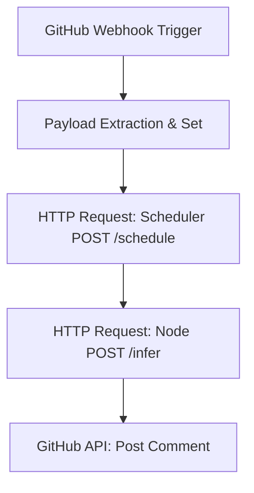

# Automation Workflow Specification

This document defines the n8n webhook orchestration blueprint to closed-loop incoming GitHub issue events directly down to the compute Node execution plane.

---

## 1. Webhook Transport Mapping

When a GitHub Issue is opened or updated, GitHub sends a webhook event. The n8n workflow intercepts this webhook and maps the input keys as follows:

| GitHub Source Key | Target Purpose | Node/Scheduler Target Mapping |
| :--- | :--- | :--- |
| `issue.title` | Model Identification | Extracted name matching registered model names |
| `issue.body` | Task Prompt | Passed as the main prompt input in `InferenceRequest` |
| `repository.clone_url` | Source Code Repository | Git repository to clone and build isolated worktree from |
| `issue.number` | Task Identifier | Used to generate the unique `worktree_target_branch` (e.g., `issue-123`) |

---

## 2. n8n Node Orchestration Pipeline

The workflow operates in a 5-stage pipeline, fully secured with network auth tokens:



### Stage 1: GitHub Webhook Trigger Node
* **Event**: `issues` (action: `opened`)
* **Output Payload JSON**:
```json
{
  "action": "opened",
  "issue": {
    "number": 42,
    "title": "[run: llama-3-70b] Run Repository Security Analysis",
    "body": "Analyze the codebase for common vulnerabilities."
  },
  "repository": {
    "clone_url": "https://github.com/public-intelligence/node.git"
  }
}
```

### Stage 2: Payload Extraction & Set Node
* **Purpose**: Parse model name from title, sanitize inputs, and set branch name variable.
* **Expressions**:
  * `model_name`: `{{ $json.issue.title.match(/\[run:\s*([^\]]+)\]/)[1] }}` (fallback to `llama-3-70b`)
  * `prompt`: `{{ $json.issue.body }}`
  * `worktree_branch`: `{{ "task-issue-" + $json.issue.number }}`

### Stage 3: Scheduler Route (HTTP Request Node)
* **Endpoint**: `POST /schedule`
* **Authentication**: `X-Network-Auth-Token` Header
* **Payload**:
```json
{
  "model_name": "{{ $node[\"Set Node\"].json[\"model_name\"] }}"
}
```
* **Expected Response**:
```json
{
  "node_id": "node-us-east-1",
  "hostname": "compute-worker-1",
  "ip_address": "54.210.15.42",
  "region": "us-east-1"
}
```

### Stage 4: Node Execution Route (HTTP Request Node)
* **Endpoint**: `POST http://{{ $json.ip_address }}:8080/infer`
* **Authentication**: `X-Network-Auth-Token` Header
* **Payload**:
```json
{
  "model": "{{ $node[\"Set Node\"].json[\"model_name\"] }}",
  "prompt": "{{ $node[\"Set Node\"].json[\"prompt\"] }}",
  "stream": true,
  "worktree_target_branch": "{{ $node[\"Set Node\"].json[\"worktree_branch\"] }}"
}
```

### Stage 5: Status Update Node (GitHub API Node)
* **Endpoint**: `POST /repos/{{ $json.repository.full_name }}/issues/{{ $json.issue.number }}/comments`
* **Payload**:
```json
{
  "body": "### Task Execution Result\n\n{{ $node[\"Node Execution\"].json[\"response\"] }}"
}
```

---

## 3. Structural n8n JSON Export (Blueprint)

Below is the complete structural JSON configuration to import into n8n:

```json
{
  "nodes": [
    {
      "parameters": {
        "httpMethod": "POST",
        "path": "github-issues-trigger",
        "responseMode": "onReceived",
        "options": {}
      },
      "id": "github-webhook-trigger",
      "name": "GitHub Webhook Trigger",
      "type": "n8n-nodes-base.webhook",
      "typeVersion": 1,
      "position": [250, 300]
    },
    {
      "parameters": {
        "values": {
          "string": [
            {
              "name": "model_name",
              "value": "={{ $json.body.issue.title.includes('[run:') ? $json.body.issue.title.split('[run:')[1].split(']')[0].trim() : 'llama-3-70b' }}"
            },
            {
              "name": "prompt",
              "value": "={{ $json.body.issue.body }}"
            },
            {
              "name": "worktree_branch",
              "value": "={{ 'task-issue-' + $json.body.issue.number }}"
            }
          ]
        },
        "options": {}
      },
      "id": "payload-extraction",
      "name": "Payload Extraction",
      "type": "n8n-nodes-base.set",
      "typeVersion": 1,
      "position": [450, 300]
    },
    {
      "parameters": {
        "method": "POST",
        "url": "http://scheduler.local/schedule",
        "sendHeaders": true,
        "headerParameters": {
          "parameters": [
            {
              "name": "X-Network-Auth-Token",
              "value": "={{ $env.NETWORK_AUTH_TOKEN }}"
            }
          ]
        },
        "sendBody": true,
        "specifyBody": "json",
        "jsonBody": "={\n  \"model_name\": \"{{ $json.model_name }}\"\n}",
        "options": {}
      },
      "id": "scheduler-schedule",
      "name": "Scheduler POST /schedule",
      "type": "n8n-nodes-base.httpRequest",
      "typeVersion": 4,
      "position": [650, 300]
    },
    {
      "parameters": {
        "method": "POST",
        "url": "=http://{{ $json.ip_address }}:8080/infer",
        "sendHeaders": true,
        "headerParameters": {
          "parameters": [
            {
              "name": "X-Network-Auth-Token",
              "value": "={{ $env.NETWORK_AUTH_TOKEN }}"
            }
          ]
        },
        "sendBody": true,
        "specifyBody": "json",
        "jsonBody": "={\n  \"model\": \"{{ $node[\"Payload Extraction\"].json[\"model_name\"] }}\",\n  \"prompt\": \"{{ $node[\"Payload Extraction\"].json[\"prompt\"] }}\",\n  \"stream\": true,\n  \"worktree_target_branch\": \"{{ $node[\"Payload Extraction\"].json[\"worktree_branch\"] }}\"\n}",
        "options": {}
      },
      "id": "node-infer",
      "name": "Node POST /infer",
      "type": "n8n-nodes-base.httpRequest",
      "typeVersion": 4,
      "position": [850, 300]
    }
  ],
  "connections": {
    "GitHub Webhook Trigger": {
      "main": [
        [
          {
            "node": "Payload Extraction",
            "type": "main",
            "index": 0
          }
        ]
      ]
    },
    "Payload Extraction": {
      "main": [
        [
          {
            "node": "Scheduler POST /schedule",
            "type": "main",
            "index": 0
          }
        ]
      ]
    },
    "Scheduler POST /schedule": {
      "main": [
        [
          {
            "node": "Node POST /infer",
            "type": "main",
            "index": 0
          }
        ]
      ]
    }
  }
}
```
