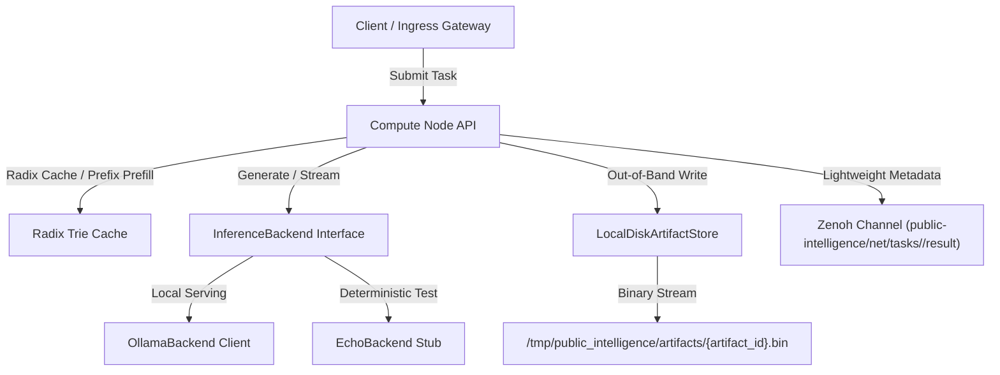

# Phase 2 Inference Backend Architecture

This document describes the decoupled inference backend layer of the Public Intelligence compute Node and its out-of-band data persistence mechanism.

## Design Goals

1. **Provider Agnostic**: Core Node lifecycle logic remains entirely decoupled from concrete LLM execution runtimes.
2. **Standardized Contract**: All engines implement the async interface defining model setup and synchronous/streaming text generation.
3. **Robust Isolation**: Traps client connection states and network outages without compromising Node serving lifecycles.
4. **Decoupled Control & Data Planes**: Offloads heavy task output payloads out-of-band while sending lightweight metadata over control transport channels.

## Request Execution Flow

## Abstract Interface

Defined in `src/node/backends/base.py`, the `InferenceBackend` class mandates three core methods:
- `initialize()`: Sets up connection pools and validates that the serving backend is online.
- `generate(model, prompt, options)`: Evaluates non-streaming requests.
- `generate_stream(model, prompt, options)`: Standardizes token-by-token output delivery using async generators.

## Engine Implementations

### 1. OllamaBackend (`src/node/backends/ollama.py`)
- Communicates asynchronously via `httpx.AsyncClient` targeting the local server endpoint on port 11434.
- Parses line-by-line JSON payload streaming formats directly using `aiter_lines()`.
- Catches network connection disconnect exceptions during initialization and raises standard `ConnectionError` blocks.

### 2. EchoBackend (`src/node/backends/mock.py`)
- Acts as a deterministic mock loop runner.
- Instantly mirrors the prompt back and simulates streaming output by yielding space-split token chunks asynchronously, enabling robust offline integration testing.

## Out-of-Band Data Persistence (`ArtifactStore`)

- **Local Storage Runtime**: `LocalDiskArtifactStore` writes raw output binary streams to `/tmp/public_intelligence/artifacts/{artifact_id}.bin`.
- **Content-Addressed Hashing**: Enforces strict `artifact_id` format invariant:
  $$\text{artifact\_id} = \text{art\_\{task\_id\}\_\{checksum[:12]\}}$$
- **Decoupled Transport**: Bypasses heavy data payload transmission over control channels. Compute workers transmit only lightweight `ArtifactMetadata` (storage URI, SHA-256 checksum, and execution metadata) across Zenoh mesh channels (`public-intelligence/net/tasks/<task_id>/result`).

## Verification Telemetry Benchmarks

- **Test Pass Rate**: 159 / 159 total passing tests (65 Node, 94 Scheduler).
- **Dynamic Stale Node Eviction Boundary**: $15.05\text{ seconds}$ under unannounced network drops ($\Delta t > 15.0\text{s}$).
- **Static Analysis Compliance**: 100% compliance with `ruff check`, `ruff format`, and strict `mypy` zero-type-leak verification.
