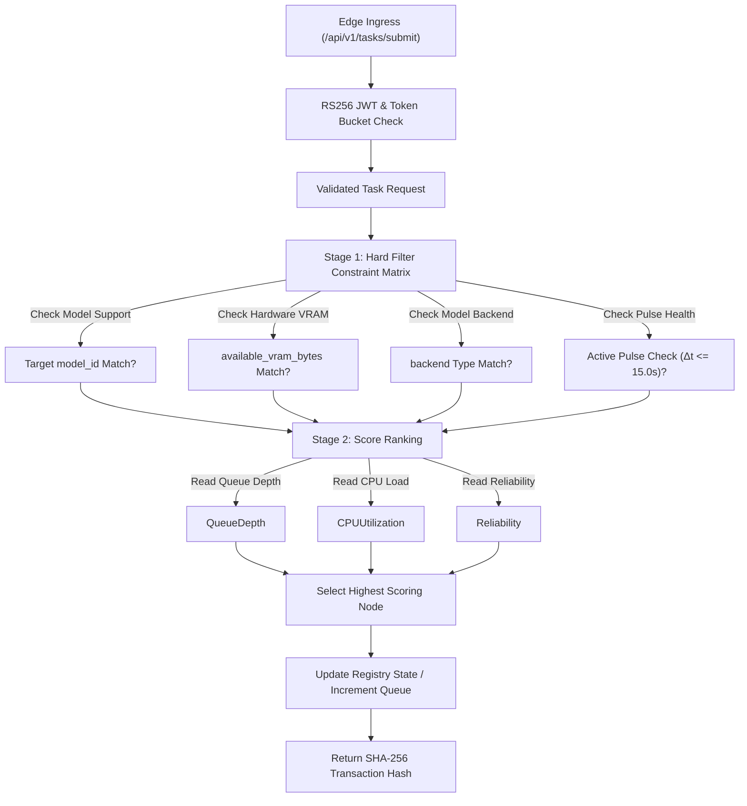

# Phase 2 Two-Stage Scheduling Engine Architecture

This document describes the design of the decoupled two-stage capability matchmaker scheduling engine inside the Public Intelligence control plane.

## Design Goals

1. **Strict Decoupling**: Separate node capability checks from real-time performance evaluation.
2. **Pluggable Strategy**: Ensure strategy wrappers conform to the `SchedulingStrategy` contract so that new selection heuristics can be introduced without modifying the core scheduling engine.
3. **Telemetry Driven**: Leverage dynamic telemetry metrics to balance resource loads across compute pools.

## Ingress & Rate Limiting Controls

The edge ingress gateway proxy exposes `/api/v1/tasks/submit`:
- **Auth Guard**: Asymmetric `RS256` JWT authentication validating signatures against configured public keys.
- **Rate Limiting**: In-memory `TokenBucketLimiter` isolated per `tenant_id`:
  - **Burst Capacity**: 5 tokens
  - **Refill Rate**: 1 token per 2.0 seconds
  - **Overflow Trigger**: Instant HTTP 429 Too Many Requests response.

## Multi-Stage Process Flow

The scheduling engine routes each incoming task payload through two sequential execution stages:



## Strategy Layer

The strategy classes reside inside `src/scheduler/core/`:
- `strategy.py`: Declares the base `SchedulingStrategy` interface.
- `matchmaker.py`: Implements `CapabilityMatchmaker` concrete strategy checking model list, available VRAM, backend type, and active heartbeat pulse, followed by dynamic loading load-balancing score calculation.

### Stage 1 Constraint Filtering Matrix
Candidate nodes are evaluated against hard constraints:
1. `backend`: Hardware runtime compatibility (e.g., `ollama`, `vllm`).
2. `model_id`: Presence of requested model identity.
3. `available_vram_bytes`: Memory availability exceeding required threshold.
4. Active pulse check: Timestamp age $\Delta t \le 15.0\text{s}$ from last valid heartbeat.

### Stage 2 Fitness Scoring Formula

The Matchmaker computes relative node fitness using the following formula:
```python
Score = (Reliability * 100.0) - (QueueDepth * 15.0) - (CPUUtilization * 0.5)
```
This formula prioritizes nodes that:
1. Maintain high historical reliability ratings.
2. Have minimal request queue depths.
3. Exhibit low CPU workload percentages.

## Orchestration Engine (`src/scheduler/core/engine.py`)

The orchestrator `SchedulingEngine` handles:
1. Retrieval of live node arrays from `NodeRegistry`.
2. Pipeline evaluation across capability filters and dynamic scoring.
3. Local state updates on the registry (incrementing allocated node queue depths).
4. Generating and returning a unique transaction hash (SHA-256 hex digest) identifying the allocation.

## Verification Telemetry Benchmarks

- **Test Pass Rate**: 159 / 159 total passing tests (65 Node, 94 Scheduler).
- **Dynamic Stale Node Eviction Boundary**: $15.05\text{ seconds}$ under unannounced network drops ($\Delta t > 15.0\text{s}$).
- **Static Analysis Compliance**: 100% compliance with `ruff check`, `ruff format`, and strict `mypy` zero-type-leak verification.
